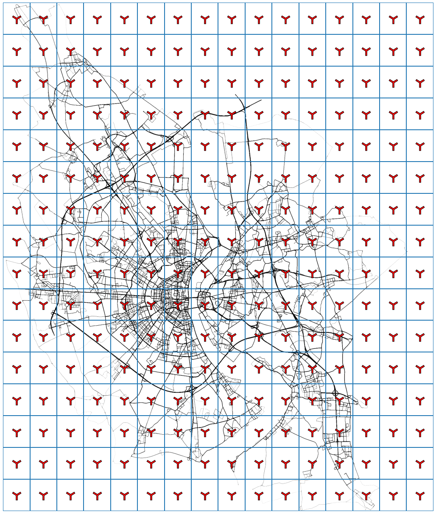
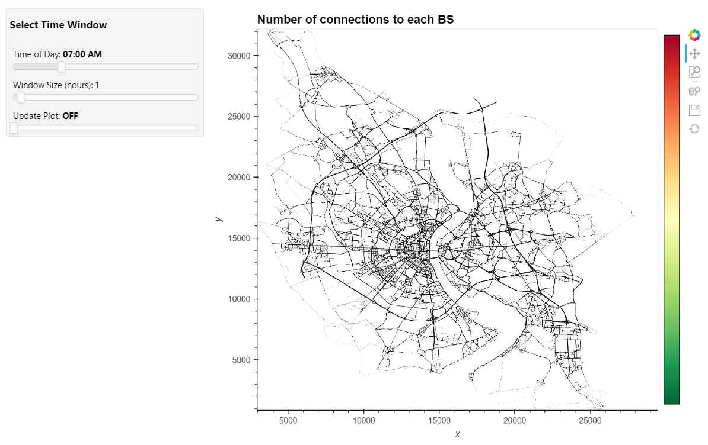

# Koln Traffic Regulator with Parallel Computing 
Our work starts from a project jointly developed by IBM and by the German city of Koln thought to be a first step towards traffic regulation and an efficient exploitation of transport’s resources. The mobility is emulated with [SUMO](https://sumo.dlr.de/docs/index.html), an open-source traffic simulation suite which allows generating the movement around a predefined city road map, extracting the data for the analysis from past traffic scenarios.

The dataset at our disposal was 20 GB space separated text file composed with the following columns:
- `time [s]`: the time-stamp of each record with a granularity of one second;
- `ID`: the vehicle identifier;
- `x`: the x position of the correspondent car;
- `y`: the y position of the correspondent car;
- `velocity [m/s]`: the speed of the correspondent car;

## Group members
- [Tommaso Amico](https://github.com/tommasoamico)
- [Andrea Lazzari](https://github.com/AndreaLazzari)
- [Paolo Zinesi](https://github.com/PaoloZinesi)
- [Nicola Zomer](https://github.com/NicolaZomer)

## List of notebooks
- Notebook 1: [Grid and Benchmark on n files](/1-Introduction_and_grid.ipynb)
- Notebook 2: [Group By](/2-Metrics_groupby.ipynb)
- Notebook 3: [Fold By](/3-Foldby_approach.ipynb)
- Notebook 4: [Dashboard and Streaming](/4-Dashboard_and_streaming.ipynb)

## Overview
### Notebook 1: Grid and Benchmark on n files
In first place we create a grid of rectangles that spans the whole map at our disposal and we fill it placing the corresponding Base Station (BS) at the center of each rectangle. We report here the image of the resulting grid superimposed on the map of Koln.  

  

Each car is then associated with the closest BS, that is the one in the same rectangle of the grid where the car is, having as a result a unique matching between vehicles and BS. 

Here we implement also the first benchmark, to inspect what is the optimal number of files when importing the data. The original ~ 20 GB of data are imported either as one single file, two files or four files. The import is performed at fixed `{n_workers=4, nthreads=1, blocksize=9.455MB}`, which are the intermediate values in the benchmark analysis performed successively. The result is used to fix the number of files in the following computations, and optimize the data import.

### Notebook 2: Group By
After some data-cleansing operations, we compute 4 different metrics by applying `groupby` and `aggregate` functions:
1. Mean time spent in each BS
2. Maximum number of cars connected at the same time to a BS
3. Total number of connection to each BS in the whole day
4. Total number of cars in each BS in the whole day

These metrics are shown in a heat map, superimposed on the Koln map. 

### Notebook 3: Fold By
In this second approach we take a different path, exploiting daskbags in order to use a foldby operation to perform the needed aggregation. Apart from the data cleansing, which is exactly equal, this branch of our work is developed hand in hand with the previous one, having in mind the goal of obtaining the same results.

The goal of this notebook is indeed to compare, on the same task, the foldby method against a groupby on a distributed Dask data frame.

### Notebook 4: Dashboard and Streaming
First we build an interactive dashboard using the Python libraries [Panel](https://panel.holoviz.org/) and [HoloViews](https://holoviews.org/). In the app it is possible to select a time window using 2 sliders (starting time and size of the window). When the update slider is set on "ON", the dataframe with the total number of connections to each BS in the selected time window is computed and the plot is updated. 

  

Then, we implement the possibility to generate a stream of data from the dataset with the number of car connected to each BS at each time. We use the library [streamz](https://streamz.readthedocs.io/en/latest/), which supports a Dask integration. The data is streamed sequentially, streaming the information related to a specific time instant one next to the other. The input data from the stream are stored in a [streaming dataframe](https://streamz.readthedocs.io/en/latest/dataframes.html) and a time window is set to update the plot. The plot of the number of connections to each BS and of table with the input data are realized using again the library [HoloViews](https://holoviews.org/).

## Benchmark 
In order to inspect how the performances change with respect to the cluster's architecture we perform some benchmarks on a pruned version of the dataset (~ 1 GB). We tried different values of the main parameters of our setup, such as the number of workers (`n_workers`) for each machine, the number of threads per worker (`nthreads`) and the block size (`blocksize`) used to read and import the data. We do this for both DAG optimizations. The resulting plots and tables can be found in the notebook [5-Benchmark_results](/5-Benchmark_results.ipynb), while the data are stored in the folder [benchmark_data](/benchmark_data/).

